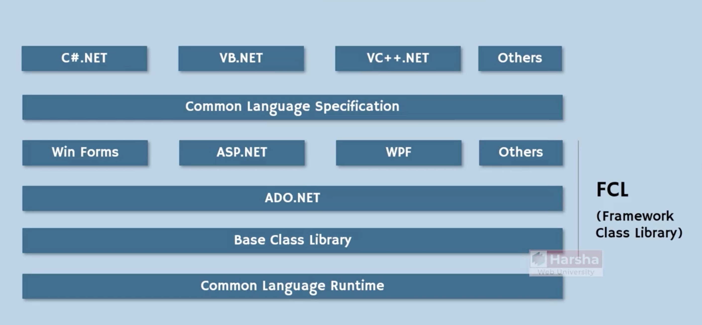
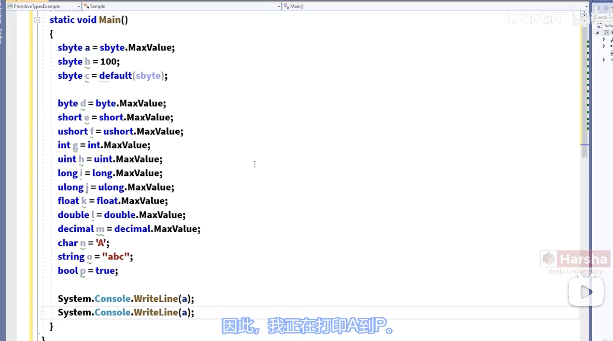
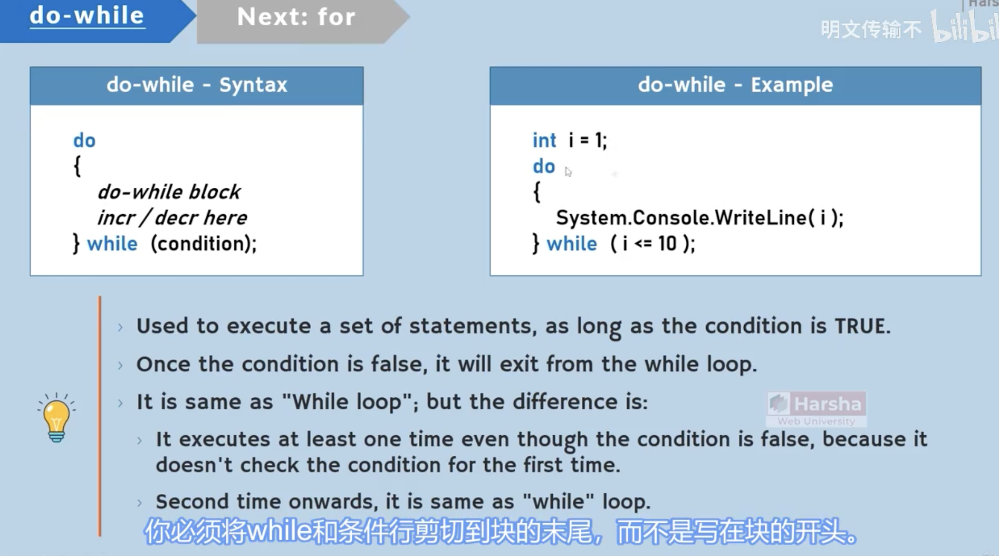
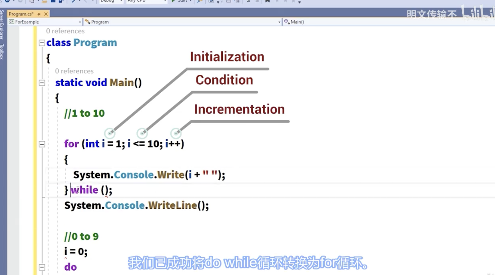
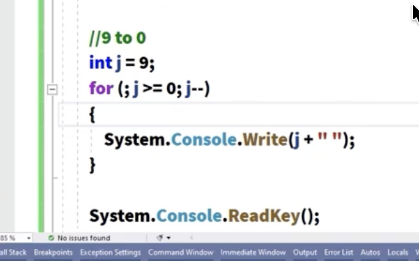

1. .NET 提供了一个称为 CLR的安全执行环境来运行应用程序，任何.NET app可在safe environment中running more efficiently.  
2. .NET supports multiple languages such as c#, VB, VC++.. etc  
3. (1). [ASP.NET](http://ASP.NET): website, web app, web services.
 (2). C#.NET: windows GUI app(with button, labels, text box), windows services(without button, labels, text box), console apps(command lines combined app).  
4. CLI(common language infrustructure)
app source code(c#.NET) ===complie===> IL(microsoft intermediate language) ======> CLR(common language runtime, execution engine of all .NET modules, (my thoughts: like java jvm or java jdk?)) ======> Native window code(executed by operating system)  
5. components of CLR  
    1. class loader  
        1. loading classes(from compiled source code to memory).  
        2. loads a class, when it is needed(before creating object.) (my thoughts: like java lazy mode, when needed then initialized?)  
    2. memory manager  
        1. allocating necessary memory for objects.  
        2. when an object is created in the code, certain amount of memory will be allocated for the object in application’s “heap”.  
    3. garbage collector  
        1. freeing(deleting) memory of objects  
        2. identifies all unreferenced objects and delete them in memory(RAM).  
    4. JIT(just in time) compiler:  
        1. convert the MSIL code into native machine language  
        2. compiles the code of a class, when it is needed(before executing that particular class).  
    5. exception manager:  
        1. raise notifications while run-time errors.  
        2. creates exception logs.  
    6. thread manager:  
        1. create threads(background process) to execute the code.  
        2. the entire program is treated as “main thread”.  
        3. developer can create sub threads(child threads) to do background processes.  
    7. security manager  
        1. verifies whether the application has permission to access system resources or not.  
        2. before exectuing the application, it verifies whether the application has not attacked by malicious programs & has necessary permissions to access files / folders and hardware resources.  
6. FCI  
7.   
8. Namespace(my thoughts: this seemed no corresponding part with java, maybe package like in the same dir, when we import java file in same dir shows the same “namespace”)  
    1. namespace is a collection of classes.  
    2. the goal of namespace is to group-by the classes that are meant for specific purpose.  
    3. programmers can access the class of a namespace, by using: ==namespace.class==  
9. Main method for C# program(my thoughts: this is similar with java program, each java file has “public static void main(string[] args){…}”)  
    1. every c# program should have a class with “Main”method. “M” is uppercase.  
    2. Main method should be “static” method. A static method can be executed without creating any object for the class.  
    3. Main method should return “void”. “void” is keyword that specifies that the method dones’t return any value to the caller.  
10. Types  
    1. primitive types  
        1. sbyte, byte, short, ushort, int, uint, long, ulong, float, double, decimal, char, bool.  
            1. strictly stores single value.  
            2. primitive types are basic building blocks of non-primitive types.  
            3. get their range: e.g. short.MinValue, short.MaxValue  
            4. float a = 0f  
            5. double b = 0.0d  
            6. decimal c = 0.0m  
    2. non-primitive types  
        1. string, Classes, Interfaces, Structures, Enumerations  
            1. stores one or more values.  
            2. usually contains multiple members.  
    3. types example  
    4.   
11. operators  
    1. increment/decrement operators  
        1. n++/++n, n—/—n: pre/post-incrementation, pre/post-decrementation, same as java  
    2. logic(and , or)  
        1.   
    3. logic xor  
    4.   
    5. concatenation operator  
        1. same like java “string1”+”string2” == “string1string2”  
    6. logic symbols  
    7.   
12. logic procedure  
    1. switch case  
        1.   
    2. dowhile and while  
        1.   
        2. for loop(also similar to java, I think basically same)  
            1.   
            2.   
        3. goto(jump to certain place of code, or within a block of code)  
            1.   
            2. go forward  
                1.   
            3. go backward(but become infinite running)  
                1.   
            4. one way to use goto  
                1.   
13. class contains: Fields, Methods, Constructors, Properties, Events, Destructors.  
14. class access modifier  
    1. internal: internal class is accessible within the same assembly. This type of class can be only accessed in the same program  
    2. public: public class is accessible in the same assembly and also in other assemblies. Other program can access the particular public class if they import that program.  
15. class modifier  
    1. static: static class contains only static members.  
    2. abstract: abstract class can additionally contain abstract methods.  
    3. sealed: sealed class can’t be inherited.  
    4. partial: multiple partial classes that have same name are combined into single class.  
16. class library: make one program as class library then it can be reused by other c# programs.  
17. OOP part: creating object  
    1. objects stores in the heap, and referenceVariables pointed to the location of object and store in the stack. Object is a collection of fields that is stored inside the Heap. Create object and store its reference into the ReferenceVariable.   
        1.  Object by default is anynomous, in order to reference them, we need a referenceVariable to reference that variable/object.  
        2. ClassName referenceVariable = new ClassName(); (my thoughts: same as java).  
        3. ==Class is a model of Object. Field is a individual detail about the Object. Reference variables are used to store the reference of object.==  
18. Key points to remember  
    1. Object is a programmatic representation of a person or thing.  
    2. All objects are created based on classes; stored in ‘heap’.  
    3. For each application execution, a new heap will be created(and only one).  
    4. All reference variables(local variables of methods) are stored in stack. For each method call, a new stack will be created.  
    5. Method is a collection of statements to perform some operation/calculation.  
    6. Class supports 2 access modifiers: ‘internal’ and ‘public’.  
    7. Class supports 4 modifiers: static, abstract, sealed, partial.  
    8. Objects stores actual data(group of fields) & can access methods of class.  
    9. A reference variable stores address of an (only one) object.  
    10. Single value—‘Field’, operation/calculation—‘Method’.  
